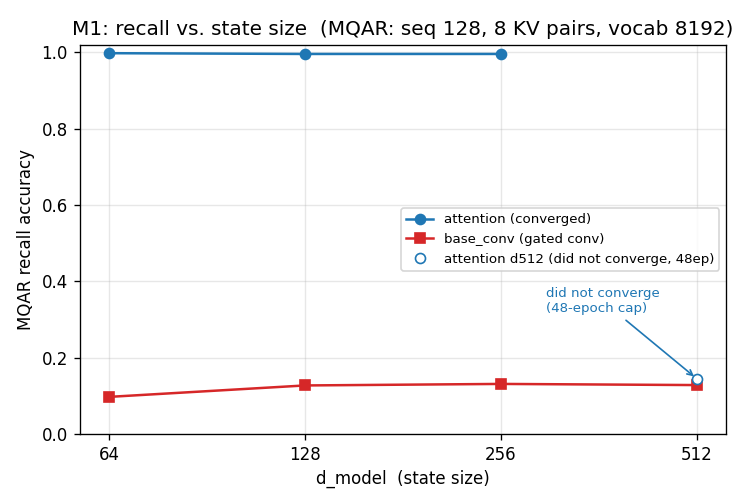

# M1 results — recall vs. state size on MQAR

**Run:** 2026-06-28, Colab T4, Zoology harness. MQAR fixed at `input_seq_len=128`,
`num_kv_pairs=8`, `vocab_size=8192`. Swept `d_model ∈ {64,128,256,512}` × `{attention (MHA),
base_conv}` × 3 learning rates; best accuracy per point shown.

## Frontier (best valid/accuracy over the LR sweep)

| d_model | attention | base_conv |
|--------:|----------:|----------:|
| 64  | **0.998** | 0.097 |
| 128 | **0.996** | 0.127 |
| 256 | **0.996** | 0.131 |
| 512 | 0.145 \* | 0.128 † |

\* attention at d512 **did not converge within the 48-epoch cap** — an optimization artifact
(larger models phase-transition later), not a capability limit. Excluded from the headline claim.
† base_conv d512 is a partial run (Colab runtime stopped at epoch 15; it had plateaued ~0.13).

## What it shows

- **Attention solves MQAR at every converged size** (d64–d256: ~0.99), because its O(n) KV cache
  can address any past token.
- **base_conv (a gated convolution) cannot** — it sits at **~0.10–0.13 across d64, d128, d256**,
  barely above chance, and does **not** improve as state grows in this range. This is the
  associative-recall wall: a fixed-size convolutional state can't hold/address 8 arbitrary
  key→value bindings over a vocab of 8192.
- The separation is **~0.87 absolute** and **stable across three model sizes** — a clean
  reproduction of the Zoology recall gap.

### Why this is a *strong* result
On the efficient model, **train loss → ~0 while validation recall stays ~0.10** (see `sweep.log`):
it memorizes training data but cannot generalize the recall mechanism. So the gap is **architectural,
not an undertraining artifact** — which closes the obvious "just train it longer" objection.

## Caveats / next runs
- The d512 attention non-convergence means the clean frontier is **d64–d256**. To extend cleanly to
  d512 (and beyond), raise `max_epochs` or add LR warmup for the large models.
- base_conv didn't rise with `d_model` here because the task (8 KV pairs, vocab 8192) is hard enough
  to saturate it low across this range. A harder sweep over `num_kv_pairs` would trace the full
  recall-vs-state curve.

## M2
Add `zoology.mixers.deepseek_nsa.SparseAttention` (content-based sparse attention, the SSA family)
as a third curve on this same plot. The research question: does it track the attention ceiling while
staying sub-quadratic, or fall toward the base_conv floor?
