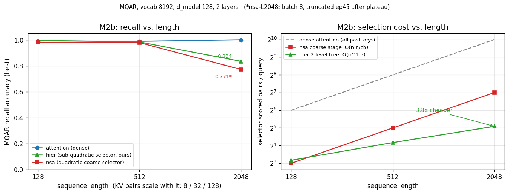

# M2b results — recall vs. length with a sub-quadratic selector

**Runs:** 2026-07-03 → 2026-07-10, Zoology harness (`experiments/m2b_hier_frontier.py`).
MQAR with task difficulty scaling with length: `input_seq_len ∈ {128, 512, 2048}`,
`num_kv_pairs ∈ {8, 32, 128}`, `vocab_size=8192`, `d_model=128`, 2 layers.
Three sequence mixers: **attention** (dense MHA), **nsa**
(`zoology.mixers.deepseek_nsa.SparseAttention` — content-based block-sparse attention whose
coarse scoring stage is O(n·n/cb), i.e. still quadratic), and **hier**
(`src/hier_nsa.py`, ours — same fine top-k attention but the coarse stage is a 2-level tree:
score `√nblk` super-block summaries, descend into the top-2, giving O(n^1.5) selection).

L128 swept 3 LRs on Kaggle 2×T4; L512+ used lr 3.2e-4 (the only LR of the three that converged
for *any* mixer at L512: 1.8e-3 → 0.024, 1e-2 → ~0). L2048 ran on a rented L40S 48GB.

## Recall (best valid/accuracy)

| length | KV pairs | attention | hier (ours) | nsa | hier − nsa |
|-------:|---------:|----------:|------------:|--------:|-----------:|
| 128  | 8   | 0.991 | **0.995** | 0.981 | +0.014 |
| 512  | 32  | 0.988 | **0.983** | 0.978 | +0.005 |
| 2048 | 128 | 1.000 | **0.834** | 0.771 \* | +0.063 |

\* nsa-L2048 ran at batch 8 (see caveats) and was truncated at epoch 45/70 after a 6-epoch
plateau (0.766–0.771 across ep40–45). L512 precedent: nsa peaks then *drifts down*
(0.978@ep32 → 0.968@ep99), so 0.771 is at/near its peak, not an undertrained number.

## Selection cost (selector-stage scored pairs per query, printed by the harness)

| length | hier | nsa | hier advantage |
|-------:|-----:|----:|---------------:|
| 128  | 9  | 8   | 0.9× (parity) |
| 512  | 18 | 32  | **1.8× cheaper** |
| 2048 | 34 | 128 | **3.8× cheaper** |

The gap grows with length by construction — hier scores `√nblk + 2·√nblk` summaries vs.
nsa's all-`nblk` — and the recall table shows what that discount costs.

## What it shows

1. **At L128 and L512 the sub-quadratic selector is free.** hier matches attention within
   0.005–0.008 and edges out nsa at both lengths, while already 1.8× cheaper at L512. It also
   converges fastest: at L512 hier early-stopped at **epoch 14** vs. nsa's best at ep32 and
   attention's at ep52.
2. **At L2048 sparsity itself starts costing recall — but the cheap selector costs *less* of
   it.** Both sparse mixers fall off the dense ceiling (attention hits 1.000), yet hier keeps
   **0.834 vs. nsa's 0.771 at 3.8× less selection compute**. At this length hier strictly
   dominates nsa on both axes.
3. **The headline is therefore not "sparse recall is free"** (SubQ's implied claim) — it's
   that *paying the quadratic selector price buys you nothing at any tested length*: the
   O(n^1.5) tree selects as well or better, and the recall that is lost at L2048 is lost by
   block-sparsity itself, not by the tree approximation.

## Caveats (read before quoting)

- **nsa-L2048 ran at batch 8**, not the batch 16 used by attention/hier at L2048: its backward
  materializes a single 32 GiB tensor at batch 16, OOMing even a 48 GB L40S alone. Batch 8
  gives it *more* gradient updates per epoch (2500 vs 1250 steps); at truncation it had ~112k
  updates vs. hier's 125k — a comparable budget, and the direction of the difference favors nsa.
- **Single seed, and single LR at L512/L2048** (3.2e-4 — chosen because it was the only
  converging LR, not tuned per-mixer). The L2048 gap (0.834 vs 0.771) is bigger than plausible
  LR noise, but multi-seed confirmation is still owed.
- **hier-L2048 genuinely plateaued**: flat at 0.830–0.834 from ~ep89 through ep99 of a full
  100-epoch run. Not an early-stop artifact.
- **Cost metric is selector scored-pairs/query**, not wall-clock or FLOPs. Both mixers pay the
  identical fine-attention cost on top (top-4 blocks of 16 + sliding window 32); the prototype
  is gather/mask-based, so wall-clock is only indicative. (In wall-clock terms nsa is *heavy*:
  ~4.15 it/s at L2048-b8 vs ~9–10 it/s for hier/attention at b16 on the same card.)
- **hier is LR-fragile at high LR** (lr 1e-2 → 0.000 at L128), same family of sensitivity as
  nsa showed in M2a. The working recipe is lr 3.2e-4 everywhere.
- MQAR convergence is phase-transition-like (flat ~0 for dozens of epochs, then a jump); all
  headline runs are past their transition, but budget-capped reruns of these configs should
  keep ≥100-epoch ceilings.

## Provenance

| point | log (commit) | hardware / date |
|-------|--------------|-----------------|
| L128 all | `m2b_shard{0,1}.log` @ `74ecfe7` | Kaggle 2×T4, 2026-07-03 |
| L512 attention | `m2b_shard1.log` @ `e2d484d` | Kaggle T4, 2026-07-04 |
| L512 hier/nsa | `m2b_shard{0,1}.log` @ `38d63c7` | Kaggle T4, 2026-07-05 |
| L2048 attention+hier | `logs/l2048_a.log` @ `c677c95` | Brev L40S, 2026-07-10 |
| L2048 nsa | `logs/l2048_nsa.log` @ `c677c95` | Brev L40S, 2026-07-10 |

(Shard logs were overwritten in place by later launches — the commits above are where each
sweep's final state lives. Parser: any `run_id='…'`-delimited zoology log; watch the known
artifact where `6.25e-5`-style sci-notation naively parses as `6.25`.)

## Next

- **Selector-budget sweep at L2048** (raise `S1` / `K_SEL`): trace recall vs. selector compute
  between hier's 34 and nsa's 128 pairs/query — does hier recover toward 1.0 while staying
  sub-quadratic? This is the follow-up the L2048 gap sets up, and the core of the paper.
- **Seeds**: 3-seed reruns of the L2048 row (cheap for hier/attention; nsa needs a ≥48 GB card
  or a memory-fixed backward).
- **L8192 hier-only** (dense attention OOMs): does hier's recall keep degrading smoothly or
  collapse?
